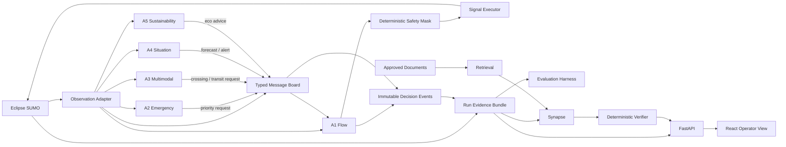
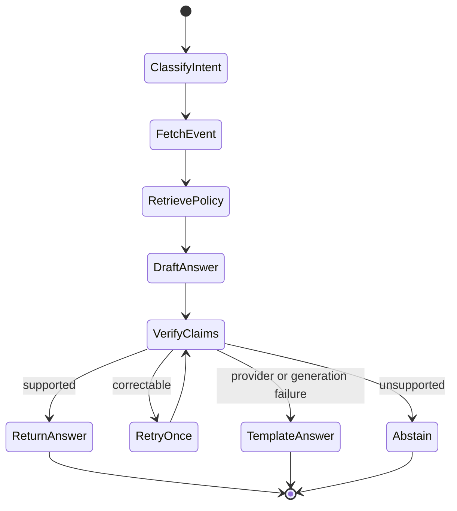

# CoFlow-5 Synapse Design

## Overview

CoFlow-5 Synapse is a Reliable AI decision platform built around Eclipse SUMO. Five domain agents cooperate, but only A1 Flow owns traffic-signal actuation. The required controller is cooperative Max-Pressure. The Synapse layer retrieves evidence and explains immutable decisions but cannot actuate SUMO.

The design optimizes for:

- cooperation with explicit authority;
- deterministic safety;
- reproducible evaluation;
- graceful failure recovery;
- evidence-grounded explanations;
- CPU-first delivery by three dependable contributors.

Reinforcement learning is optional and enters only after the required cooperative evidence slice is frozen.

## Architecture



## Authority model

### Signal authority

The signal executor accepts commands only from A1 through the safety mask. No other module receives the executor capability.

One A1 executor is assigned to each controlled signal. Executors may share a controller implementation or optional learned model, but each signal has exactly one writer.

### Advisory authority

A2–A5 can observe approved state and publish typed advice. They cannot call TraCI signal-write functions.

### Synapse authority

Synapse can:

- read completed or live evidence exposed through a read interface;
- retrieve allow-listed documents;
- produce and verify explanations;
- draft a what-if scenario request;
- pause for human approval.

Synapse cannot:

- call the signal executor;
- mutate active scenario state;
- bypass job capacity or approval;
- treat generated text as a decision event.

## Component design

### Scenario registry and runner

Responsibilities:

- validate scenario and controller configuration;
- enforce idempotency and bounded concurrency;
- launch SUMO through TraCI for diagnosis or measured libsumo for batches;
- assign run identity;
- finalize the run evidence bundle;
- support cancellation and explicit terminal status.

The first runner targets native Windows with Python 3.11 and one pinned SUMO release. Container packaging follows only after the native smoke test passes.

### SUMO observation adapter

Responsibilities:

- convert SUMO identifiers and values into stable domain observations;
- expose current phases, elapsed times, queues, occupancy, waits, approaching road users, downstream capacity, trip outcomes, and configured safety measures;
- isolate version-specific TraCI/libsumo details;
- never embed controller policy.

The RoadwayVR SUMO tutorial may be used to understand TraCI calls. It is not a runtime dependency because its examples use hard-coded identifiers, incomplete referenced scenarios, direct signal writes, and non-production RL loops.

### A1 Flow

Required algorithm:

1. read current local observation;
2. collect valid messages for the decision epoch;
3. preserve the priority tiers;
4. calculate cooperative Max-Pressure scores for legal candidate movements;
5. adjust same-tier selection using bounded benefit and externality fields;
6. propose an action;
7. pass the action through the deterministic safety mask;
8. execute or recover;
9. write an immutable reason-coded event.

Optional DQN implements the same controller interface. It cannot change message, safety, execution, logging, or evaluation contracts.

### A2 Emergency

Inputs:

- emergency vehicle position and route;
- next controlled junctions;
- ETA and urgency;
- downstream occupancy;
- active crossings and competing emergency requests.

Outputs:

- expiring corridor-priority requests;
- expected benefit and civilian externality estimate;
- recovery completion event.

### A3 Multimodal

Inputs:

- pedestrian call, presence, wait, and crossing state;
- transit position, schedule deviation, and headway gap;
- active phase and predicted arrival.

Outputs:

- mandatory crossing-clearance state;
- wait-deadline escalation;
- conditional transit-priority request.

### A4 Situation

Required model ladder:

1. persistence baseline;
2. simple supervised or tree baseline;
3. LightGBM if it improves held-out chronological evaluation;
4. EWMA/CUSUM over residuals for transparent anomaly evidence.

A4 publishes forecast horizon, confidence, source time, expiry, model version, residual evidence, and a distinction between anomaly, likely incident, congestion, stale data, and insufficient data.

### A5 Sustainability

A5 computes advisory hot-spot or weight messages from SUMO/HBEFA emission proxies and queue/stop evidence. It does not claim air-quality measurement. Advice is rejected during spillback or when higher priority tiers require a different action.

### Typed message board

The first implementation is in process and transport independent.

```text
MessageEnvelope
  message_id
  correlation_id
  source_agent
  destination_or_topic
  created_at
  simulation_time
  expires_at
  priority_class
  confidence
  schema_version
  payload_type
  payload
  provenance
```

Required topics:

- `state`
- `forecast`
- `alerts`
- `eco`
- `requests`
- `replies`
- `health`

The board provides idempotent publish, valid-at-time reads, bounded storage, disposition logging, and fault injection. Redis is a later adapter, not part of the core domain.

### Safety mask and signal executor

The safety mask owns:

- legal phase-transition graph;
- minimum green;
- yellow and all-red clearance;
- pedestrian remaining-clearance protection;
- conflicting movement exclusion;
- downstream blocking constraints where configured;
- override validation.

The signal executor owns the only write connection to SUMO signals. It records every accepted command and every rejected proposal.

### Recovery supervisor

Required modes:

```text
COOPERATIVE_MAX_PRESSURE
  -> ACTUATED
  -> FIXED_TIME
```

Optional experiment:

```text
OPTIONAL_DQN
  -> COOPERATIVE_MAX_PRESSURE
  -> ACTUATED
  -> FIXED_TIME
```

Triggers include invalid output, missed decision deadline, unavailable controller, repeated rejected actions, corrupt observation, or explicit fault injection. Adviser and forecast failure remove the affected input without forcing a controller transition when local Max-Pressure remains healthy.

### Evidence store

The run manifest is the source of truth.

```text
RunManifest
  run_id
  status
  created_at / started_at / finished_at
  source_revision
  SUMO_version
  scenario_hash
  configuration_hash
  controller_name / version
  model_versions
  training_seed
  evaluation_seed
  fault_schedule_hash
  timings
  artifact_references
  invalidation_reason
```

High-volume state, message, decision, trip, fault, and KPI records use Parquet. DuckDB reads those artifacts for evaluation. SQLite or JSON stores run lifecycle. MLflow can index manifests and checkpoints later, but cannot create a second identity.

### Evaluation harness

The harness creates matched experiment cells across:

- controller;
- scenario;
- demand regime;
- incident;
- communication fault;
- adviser ablation;
- seed.

It calculates safety, efficiency, emergency, pedestrian, transit, sustainability-proxy, forecasting, robustness, retrieval, generation, and reproducibility metrics.

It must preserve:

- unfinished trips and teleports;
- failed runs;
- null and negative outcomes;
- confidence intervals;
- predeclared requirement, directional, and exploratory classifications.

### Retrieval

Initial retrieval uses:

- allow-listed sources;
- deterministic parsing;
- source manifests;
- content hashes;
- stable chunk identifiers;
- a small sentence-transformer;
- exact local cosine search.

PostgreSQL with pgvector is added after the local retrieval and provenance contract passes. It supports durable source records and metadata filtering. Pinecone is not required.

### Synapse

The bounded state flow is:



Plain typed state and functions define the domain flow. LangGraph is added for persisted human approval/resume and bounded retry after the flow works. The hosted LLM is behind a provider-neutral adapter. A deterministic template implementation is mandatory.

### API

Stable operations:

- create a scenario run;
- get run status and manifest;
- cancel a queued or active run;
- list run events;
- retrieve evaluation summaries;
- request a cited explanation;
- submit and approve a what-if request.

Requests and responses use Pydantic schemas. Long work is queued and cancellable. Progress uses server-sent events unless bidirectional communication becomes necessary.

### React operator view

Required views:

- scenario/run selection;
- controller and recovery state;
- agent-message timeline;
- accepted and rejected requests with reason codes;
- baseline and ablation comparison;
- explanation with event and policy citations;
- limitation and data-source labels;
- trace/evaluation link.

The hosted interface reads precomputed SUMO evidence. UI work does not block the course prototype.

## Scenario design

### Controlled benchmark

The main scientific environment is a controlled 4×4 grid. Development starts with a single junction and corridor. Demand regimes include balanced, asymmetric, surge, and incident conditions.

Required road users:

- general vehicles;
- emergency vehicles;
- pedestrians;
- scheduled transit.

Required faults:

- message loss;
- delay;
- duplication;
- expiry;
- malformed payload;
- adviser silence;
- A4 false or missing alert;
- controller failure;
- Synapse and provider outage.

### Tunis showcase

The showcase uses:

- an explicit OSM extraction boundary;
- official TRANSTU scheduled GTFS from Tunisia’s transport CKAN portal;
- generated or calibrated synthetic road demand;
- clear source and limitation labels.

It demonstrates data ingestion and local relevance. It is not the primary controller benchmark and does not establish field performance.

## Data preparation and EDA

Each dataset has an explicit unit of observation:

- junction/movement per simulation step;
- A1 decision epoch;
- advisory message and disposition;
- trip or person outcome;
- link, forecast origin, and horizon;
- run/controller/scenario/seed KPI;
- document chunk;
- golden operator question.

EDA checks distributions, warm-up, spillback, teleports, outliers, stakeholder tails, incident imbalance, message quality, forecast leakage, spatial displacement, and seed matching.

Training-only transformations are fitted only on training data. A4 uses chronological splits. Failures and unfinished trips are never removed as cleaning.

## Technology stack

### Required

- Python 3.11
- pinned Eclipse SUMO
- TraCI for visual diagnosis
- measured libsumo for headless batches
- Pydantic v2
- NumPy and PyArrow
- Parquet and DuckDB
- LightGBM and scikit-learn
- FastAPI
- pytest and Hypothesis
- Ruff and Pyright
- sentence-transformers
- React, Vite, and TypeScript

### Earned integrations

- PostgreSQL and pgvector after local retrieval passes
- Phoenix with OpenTelemetry/OpenInference after the golden set exists
- LangGraph after the typed Synapse flow passes
- Docker Compose after native execution passes
- MLflow with SQLite after the run manifest is stable
- PyTorch only for optional DQN
- Redis only for a demonstrated split-process requirement

### Rejected defaults

- LLM control of signals
- microservice per agent
- Kafka or Kubernetes
- Pinecone for the initial corpus
- LlamaIndex as the ingestion foundation
- simultaneous Phoenix and LangSmith
- local large-language-model serving on the critical path

## Correctness properties

1. At most one signal writer exists for each controlled signal.
2. No emitted action violates the legal transition or pedestrian-clearance contract.
3. Removing Synapse cannot change the action sequence for the same Control plane inputs.
4. Missing all advisory messages cannot stop legal local control.
5. A duplicate message cannot consume an arbitration budget twice.
6. An expired message cannot affect a later decision.
7. Every executed signal action has one immutable decision event.
8. Every explanation event claim resolves to immutable evidence.
9. Every policy claim in an explanation resolves to an allow-listed source chunk.
10. Every reported KPI resolves to a run manifest, scenario, controller, and seed.

## Error handling

Errors are classified rather than collapsed:

- validation;
- safety rejection;
- controller health;
- message disposition;
- simulation;
- data integrity;
- forecast;
- retrieval;
- explanation verification;
- provider;
- capacity;
- persistence;
- presentation.

The API returns stable error categories. Run failures remain visible. Provider and retrieval failures invoke template or abstention behavior. Safety and control errors invoke the recovery supervisor.

## Testing strategy

The highest acceptance seam is the run evidence bundle. Tests submit a frozen scenario and inspect the complete external result.

Additional safety-focused contract tests exercise proposed actions through the public controller boundary.

Test layers:

1. schema and deterministic property tests;
2. frozen single-junction integration tests;
3. controller and cooperation acceptance tests;
4. failure-injection tests;
5. paired scenario evaluation tests;
6. retrieval and explanation golden tests;
7. API and React acceptance tests;
8. scripted professor reliability demonstration.

The required demonstration proves:

- kill Synapse: traffic actions remain unchanged;
- drop all adviser messages: Max-Pressure continues;
- silence A4: forecast state becomes unavailable;
- fail Max-Pressure: actuated, then fixed-time recovery is visible;
- remove retrieval or fail the provider: template or abstention is returned;
- change a prompt, model, embedding, or corpus: the golden regression report changes visibly.

